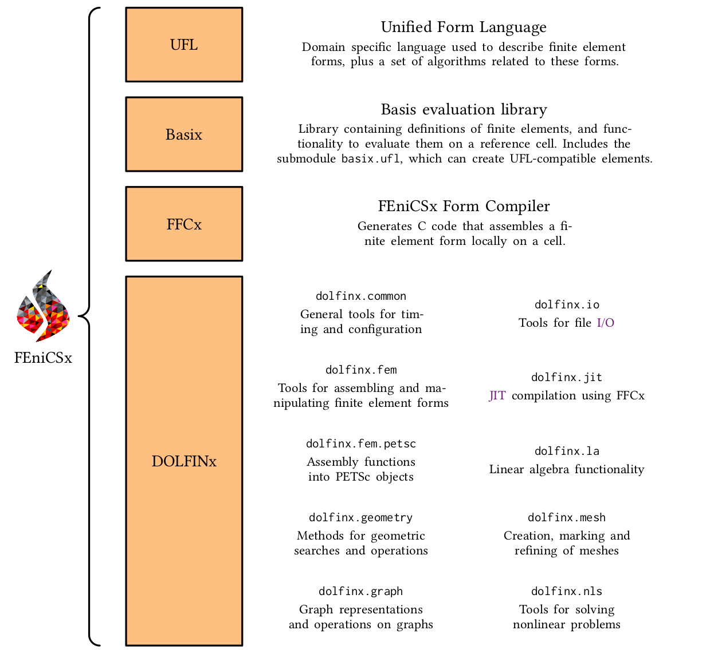

# FEniCS23-tutorial

Welcome to the FEniCS tutorial.

The aim of this tutorial is to cover some of the fundamentals of how the different components of the FEniCS project fit together
in DOLFINx.

A short summary of the various components {cite}`DOLFINx2023` can be found below.


The tutorial is currently built for `v0.7.x` of DOLFINx, for older versions see: https://github.com/jorgensd/FEniCS23-tutorial/releases

```{bibliography}
:filter: cited and ({"README"} >= docnames)
```
